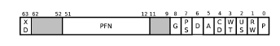
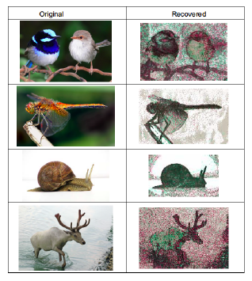
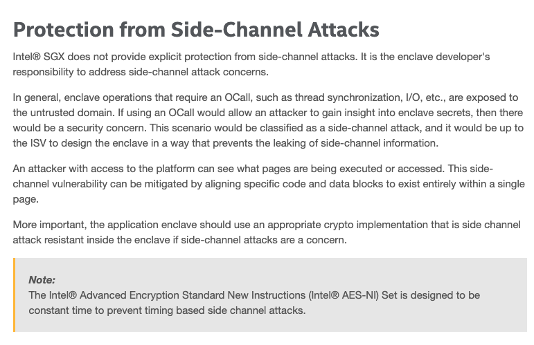

# SGX side channel文献综述

## 1. Intel SGX基础概念

Intel Safe Guard Extentions（SGX）是一组安全相关的指令代码，内置于一些现代英特尔中央处理器（CPU）中。它们允许用户级和操作系统代码定义内存的私有区域，称为enclaves，其内容受到保护，无法被enclaves外的任何进程读取或保存，包括以更高权限级别运行的进程。默认情况下，SGX处于禁用状态，用户必须通过支持的系统上的BIOS设置选择使用SGX。SGX旨在实现安全的远程计算，安全的Web浏览和数字版权管理（DRM）。其他应用包括隐藏专有算法和加密密钥。

SGX涉及CPU对一部分内存进行加密。enclave仅在CPU本身内即时解密，即使这样，也仅限于enclave内部运行的代码和数据。因此，处理器保护代码不被“窥探”或被其他代码检查。enclave中的代码和数据利用威胁模型，其中enclave受到信任，但不能信任其外的进程（包括操作系统本身和任何管理程序），因此所有这些都被视为潜在的威胁。enclave内的任何代码都无法读取除了加密形式外的enclave内容（如下图所示）。

## 2. SGX侧信道攻击

这一章从SGX内存隔离、威胁模型和侧信道攻击面来理解SGX侧信道攻击。

### 2.1 SGX内存隔离

要理解侧信道攻击，首先从理解内存侧信道开始。从第一章SGX基础概念可以知道enclave程序的设计都是围绕内存隔离的宗旨，为了保证这种后向兼容性，英特尔只能通过在处理器架构上不断推出扩展，主要有如下三种。

#### 2.1.1 虚拟内存和物理内存管理

SGX为enclave程序以及它们的控制单元预留了连续的物理内存，称为处理器预留内存Processor Reserved Memory (PRM)。CPU的扩展内存管理单元阻止enclave之外的一切程序获得PRM，包括系统内核、虚拟机hypervisors、SMM代码和DMA。

每个程序的虚拟内存有一个encla线性地址范围Enclave Linear Address Range (ELRANGE)，这是为enclaves预留且映射到EPC页表，机密的代码和数据都存储在ELRANGE。页表负责将虚拟地址转换成不可信系统软件的物理地址，工作方式和传统的TLB没差异。当CPU在non-enclave模式和enclave模式之间转换时，通过EENTER或EEXIT指令或异步Enclave Exits(AEXs)，与当前Process-Context相关联的TLB条目刷新标识符(Process-Context Identifier, PCID)以及全局标识符，防止non-enclave代码获得有关enclave内地址转换的信息。

#### 2.1.2 内存隔离安全检查

为了防止系统软件通过操纵页表条目来任意控制地址转换，CPU还在地址转换期间查询Enclave页面缓存映射（EPCM）。每个EPC页面对应于EPCM中的条目，其记录EPC页面的所有者enclave，页面的类型以及指示页面是否已被分配的有效位。分配EPC页面时，其访问权限在其EPCM条目中指定为可读，可写和/或可执行。映射到EPC页面的虚拟地址（在ELRANGE内）也记录在EPCM条目中。

由不受信任的系统软件设置的页表条目的正确性由扩展的页面错误处理程序（PMH）保证。当代码在安全区模式下执行或地址转换结果落入PRM范围时，将进行额外的安全检查。特别是，当代码在non-enclave模式下运行并且地址转换落入PRM范围，或者代码在安全区模式下运行但物理地址未指向属于当前enclave的常规EPC页面，或者触发页表行走的虚拟地址与EPCM中相应条目中记录的虚拟地址不匹配，将发生页面错误。否则，将根据EPCM条目和页表条目中的属性设置生成的TLB条目。

#### 2.1.3 内存加密

为了支持比EPC更大的ELRANGE，EPC页面可以“交换”到常规物理内存，这个过程称为EPC页面收回。 通过经过身份验证的加密可以保证被收回页面的机密性和完整性。 硬件内存加密引擎（Memory Encryption Engine，MEE）与内存控制器集成在一起，无缝加密EPC页面的内容，该内容被收回到常规物理内存页面。 消息验证代码（Memory Encryption Engine，MAC）保护加密的完整性和与被收回页面相关联的随机数。 加密的页面可以存储在主存储器中，或者交换到类似于常规页面的二级存储器。 但是，与加密相关联的元数据需要由系统软件正确保存，以使页面再次“交换”到EPC中。

### 2.2 威胁模型

侧信道攻击主要目标是攻击enclave数据的机密性（confidentiality）。攻击者来自non-enclave 部分，包括应用程序和系统软件。系统软件包括OS，hypervisor，SMM，BIOS 等特权级软件。

侧信道攻击一般假设攻击者知道enclave初始化时候的代码和数据，并且知道内存布局。内存布局包括虚拟地址，物理地址以及其之间的映射关系。有些侧信道攻击假设攻击者知道enclave的输入数据，并且可以反复触发enclave，进行多次观察记录。侧信道攻击还假设攻击者知道运行enclave平台的硬件配置、特性和性能，比如CPU，TLB，cache，DRAM，页表，中断以及异常等各种系统底层机制。

### 2.3 侧信道攻击面

enclave和non-enclave共享大量的系统资源，这就给侧信道攻击留下了非常大的攻击面。抽象的可概括为大致三类：**Spatial granularity**，**Temporal observability**和**Side effects**。从系统架构来看可概括为下图。

在当今的Intel CPU架构中内存操作设计一连串的微操作：程序通过第一次访问地址翻译缓存集合并遍历内存中的页表生成的虚拟地址被翻译成物理地址，然后这个物理地址被用来获取缓存（L1，L2，L3...）以及DRAM来完成内存引用。下面具体探讨下这个过程中侧信道攻击的实现方式。

#### 2.3.1 基于地址翻译缓存

地址翻译缓存是硬件缓存，用来方便地址翻译，包括TLB和各种分页结构的缓存。下面三个因素可导致在地址翻译缓存阶段收到侧信道攻击。

- 在超线程中共享的TLB表和分页结构的缓存

- 刷新AEX中TLB和分页结构缓存中的选定条目

- 引用的PTE被缓存为数据

#### 2.3.2 基于页表

页表是主存中的多层级的数据结构，主要用于地址翻译。页表每次访问都涉及到多层的内存访问，但页表位于操作系统的kernel，当OS kernel被不受信软件占用的时候，就极容易被用来攻击enclave。

典型的页表项的格式（x64）：

下面三个因素可导致在对页表操作时收到侧信道攻击。

- enclave模式下*accessed*（图中A）标志位的更新

- enclave模式下_dirty_（图中D）标志位的更新

- enclave模式下触发的页错误

#### 2.3.3 基于缓存和内存层次结构

一旦虚拟地址被翻译成物理地址，内存引用就会同时应用与缓存和内存层次结构，但这些都只是在通电情况下才能存储的暂时行数据。以下两种因素可导致受到侧信道攻击。在层次结构的顶部是单独的L1数据和指令缓存，下一级是专用于一个CPU核心的统一L2缓存，然后由CPU包的所有核心共享L3缓存，然后是主存储器。高速缓存通常构建在静态随机存取存储器（SRAM）和动态随机存取存储器（DRAM）上的主存储器上。上层存储往往更小，更快，更昂贵，而下层存储通常更大，更慢，更便宜。内存提取从上到下遍历每个级别;上层的失误将导致进入下一级别。从较低级别获取的数据或代码通常会更新较高级别的条目，以加快将来的引用。

主存储器通常组织在多个存储器通道中。每个存储器通道由专用存储器控制器处理。一个存储器通道物理地划分为多个DIMM（双列直插存储器模块），每个DIMM具有一个或两个等级。每个等级具有几个DRAM芯片（例如，8或1​​6），并且还被划分为多个存储体。存储体阵列携带按行组织的存储器阵列，并且每个行通常具有8KB的大小，由多个4KB存储器页面共享，因为一个页面倾向于跨越多个行。bank上还有一个行缓冲区，用于保存最近访问的行。在提供内存请求之前，每个读取的内存都会将整行加载到行缓冲区中。因此，对行缓冲器中已经存在的DRAM行的访问要快得多。

- CPU缓存在enclave和non-enclave模式之间共享代码

- 整个内存的层次架构，包括内存控制器、信道、DIMM、DRAM等，都会在enclave和non-enclave模式之间共享代码

#### 2.3.4 混合信道攻击

混合侧信道攻击是同时采集多个侧信道攻击面的信息，或通过多个攻击面共同作用放大差异增加准确度。比较典型的做法包括：

1. TLB 和页表混合攻击。比如TLB miss 的时候会加载页表，这个时候CPU 会设置页表的Access bit。 

2. Cache 和DRAM 混合攻击。基于DRAM 的攻击只能精确到row（一个row 通常8KB）的粒度。为了增强这类攻击效果，有文章提出cache-DRAM 攻击来增加空间精度，把精度提高到了一个cache line（64B）。

## 3. 攻击后果

- **基于页表的攻击后果**

基于页表的侧信道攻击最典型的就是controlled-channel attack和pigeonholeattack。这类攻击的缺点就是精度只能达到页粒度，无法区分更细粒度的信息。但是在某些场景下，这类攻击已经能够获得大量有用信息。例如下所示，这类基于页表的侧信道攻击可以获得libjpeg 处理的图片信息.经过还原，基本上达到人眼识别的程度。pigeonhole 攻击也展示了大量对现有的安全库的攻击。

一个页表项有很多位，有些是用来做访问控制，比如P, RW, US, XD，有些则标识状态，比如D（dirty bit）和A（accessbit）。如果A bit 被设置，则表明该页表项指向的页面已经被访问；如果Dbit被设置，则表明该页表项指向的页面发生了写操作。通过监控观察这些状态位，攻击者就可以获取和controlled-channel/pigeonhole 攻击类似的信息。

- **基于cache的攻击后果**

传统侧信道有很多基于cache的攻击。在SGX的环境里面，这些侧信道技术仍然适用，而且可以做的更好。原因在于，在SGX 环境里面攻击者可以控制整个系统的资源。因此，攻击者可以有针对性地调度资源，减小侧信道的噪音，增加侧信道的成功率。降低噪音的策略大体可以有以下几种：

1. Core Isolation(核隔离)。这个方法的主要目标就是让enclave 独自占有一个核（不允许其他程序运行在该核上面）。

2. Cache Isolation(缓存隔离)。尽量使用L1 或者L2 级别的cache 进行侧信道攻击。L3 的cache 被所有的核共用，会引入不必要的噪音。

3. Uninterupted Execution（不间断运行）。也就是不触发或尽量少触发AEX，因为AEX 和后续的ISR（interrupt sevice rountine) 都会使用cache，从而引入不必要噪音。少触发AEX 就是要使用中断绑定（interrupt affinity）和将时钟频率。不触发AEX 基本上就是让系统软件（比如OS）屏蔽所有中断。

除了降低噪音，攻击者还可以提高攻击的精度，大体策略有：

1. 高精度时钟。可以采用APIC 提供的高精度时钟和硬件TSC。

2. 放大时间差异。比如攻击者可以配置侧信道攻击代码所在的CPU 以最高频率运行，而对enclave 所在的CPU 进行降频处理。

基于cache 的侧信道攻击可以进行细粒度的监控。最小粒度可以做到一个cache line，即64 个字节。由于粒度更小，基于cache 的侧信道可以比基于页表的侧信道（以及后面介绍的基于DRAM 的侧信道）获得更多的信息。

- **基于CPU内部结构的攻击后果**

CPU 内部有大量的结构是在enclave 和non-enclave 之间共用的。这就给侧信道攻击提供了大量的攻击面素材。比如文章[2]里面提出使用BPB（Branch Prediction Buffer）来实现侧信道攻击。具体来讲，在enclave和non-enclave切换的时候，BPB存留的跳转预测记录并没有被清除。这样使得non-enclave可以构造一个程序，测试这些跳转预测记录。如果预测成功，则执行时间较短。反之，如果预测失败，则执行时间较长。通过时间上的差异，攻击者就可以推测enclave之前运行的跳转分支，进而获得enclave运行的控制流图。通过控制流图，攻击者又可以进一步推测隐私数据，比如加密密钥等。这个攻击的强大之处在于他几乎可以还原整个控制流。这样细粒度的信息使得该攻击可以泄露很多信息。文章也进行了大量实验，充分展示了这个攻击的强大。实验表明，这个攻击可以泄露字符串信息，RSA私钥以及网络数据等等。

- **基于DRAM的攻击后果**

在访问DRAM 的时候，如果访问地址已经被缓存在row buffer当中（情况A），就直接从buffer里面读取，否则需要把访问地址对应的整个row都加载到row buffer当中（情况B）。当然，如果row buffer之前缓存了其他row的内容，还需要先换出row buffer的内容再加载新的row（情况C）。A、B、C 对应的三种情况，访问速度依次递减（情况A 最快，情况C 最慢）。这样，通过时间上的差异，攻击者就可以了解当前访问的内存地址是否在row buffer 里面，以及是否有被换出。

基于DRAM 的侧信道攻击有一些不足。第一，enclave使用的内存通常都在缓存里面，只有少部分需要从DRAM里面去取。第二，DRAM的精度不够。例如，一个页面（4KB) 通常分布在4个DRAM row上面。这样，基于DRAM的侧信道攻击的精度就是1KB。仅仅比基于页表的侧信道攻击好一些，远远不及基于cache的侧信道攻击的精度。第三，DRAM里面存在很难避免的噪音干扰，因为一个DRAM row被很多页面使用，同时同一个bank 不同row的数据读取也会对时间测量造成干扰，使得误报时常发生。

## 4. 检测及防御方法

在做SGX开发实验的时候我在官方的SGX文档下面找到了`Protection from Side-Channel Attacks`这一章，点进去一看非常有趣，如下图所示：

Intel承认SGX确实无法保证有效地避免侧信道攻击，所以把锅甩给开发者，让开发者在设计SGX程序时来避免侧信道攻击。也因此SGX的侧信道攻击可以成为一个发表论文的热门话题。本章主要从源码层级别、系统级别和硬件级别来介绍对SGX侧信道攻击检测及防御方法。

### 4.1 源码层级别

这类方法的主要思想就是通过修改源码，编写出能够防御侧信道的代码实现。这里的核心思想就是隐藏控制流和数据流。

这类方法的探索已经在一些密码算法中有所涉及。比如利用exponentblinding[4]来增强RSA算法，利用bit slicing增强DES和AES方法。在机器学习领域，也有人做了尝试。文章[7]修改了机器学习的算法，使用oblivious assignments and comparisons来隐藏控制流，使用oblivious array access（即k-anonymity）来隐藏数据流。文章[5]也采用了类似的方法，使用oblivious store 隐藏if-else 控制流，使用ORAM来隐藏数据流，从而抵御侧信道攻击。但是目前这些技术还很难在一个通用的计算环境下实现，比如loop trip count，long jump 以及break等问题。

### 4.2 系统层次级别

系统层次的解决方案主要是利用一些系统特性来防御或检测SGX 侧信道。这里有几个思路可以参考：

1. 随机化技术（Randomization）。随机化技术可以应用在控制流和数据流上面，这将大大增加侧信道攻击的代价。防御效果与随机化粒度，以及随机化频率有关。

2. 检测可疑异常和中断。T-SGX利用TSX技术来检测中断和缺页异常，从而抵御最原始的controlled-channel攻击。但是现在已经出现不需要触发AEX的侧信道攻击。

3. 检测时间异常。目前Déjá Vu 系统也使用TSX 技术来保护enclave自己的时钟。如果攻击者中断或减缓enclave的运行，enclave就可以通过自己的时钟检测出时间上的异常。目前，绝大多数侧信道攻击都会引起enclave 的显著性能下降。因此，检测时间异常还是一个比较有效的方案。

4. Cache 隔离。目前Intel 推出了CAT（Cache Allocation Technology）技术，允许对cache 进行粗粒度的隔离。这个技术已经被使用在云计算平台上面防御侧信道攻击，但是还没有看到在SGX环境里面的应用。把CAT应用到SGX 的一个很大的障碍是enclave在用户空间无法有效地检测或验证CAT的配置。

### 4.3 硬件层次级别

硬件层次的解决方案还处于探索阶段。加?侧信道防御，将会显著增加硬件复杂度，影响功耗和性能。这也可能是Intel在最初推出SGX的时候没有加入侧信道防御的一个原因。硬件解决方案可能有以下两种：

1. 硬件分割（partition）。类似于ARM里面的trustzone，有自己的cache，memory等一系列硬件资源，物理上与non-enclave分离。

2. 硬件隔离（isolation）。类似于Intel CAT 技术，可以单独为每一个enclave提供一个动态隔离出的cache。当enclave 销毁的时候，隔离出的cache 可以被收回。这个很重要的要求就是enclave必须可以验证这个功能的有效性。

## 6. 总结

通过对SGX侧信道攻击相关文献的阅读，可以得出结论：SGX侧信道攻击十分难防御，根本的原因在于SGX的安全假设和应用模型允许enclave和不可信的non-enclave共享大量的资源。因此攻击者就可以有很大的攻击面去区分时间差异和资源使用的异同，从而泄露了enclave的控制流和数据流。

SGX侧信道攻击是一个普遍存在且实用的攻击，我们在实际部署SGX应用的时候，必须考虑其威胁性并从各种角度来反制。

## 参考文献

**[1]** V. Costan and S. Devadas. Intel SGX Explained. Techni- cal report, Cryptology ePrint Archive. Report                2016/086, 2016.

**[2]** S. Lee, M.-W. Shih, P. Gera, T. Kim, H. Kim, and M. Peinado. Inferring fine-grained control flow inside sgx enclaves with branch shadowing. In 26th USENIX Security Symposium, USENIX Security, 2017

**[3]** M.-W. Shih, S. Lee, T. Kim, and M. Peinado. T-SGX: Eradicating controlled-channel attacks against enclave programs. In Network and Distributed System Security Symposium, 2017.

**[4]** S. Chen, X. Zhang, M. K. Reiter, and Y. Zhang. Detecting privileged side-channel attacks in shielded execution with D´ej´a Vu. In ACM Symposium on Information, Computer and Communications Security, 2017.

**[5]** W. Wang, G. Chen and X. Pan. Leaky Cauldron on the Dark Land: Understanding Memory Side-Channel Hazards in SGX. Conference on Computer and Communications Security. 2017.

**[6]** F. Brasser, U. Muller and A. Dmitrienko. Software Grand Exposure: SGX Cache Attacks Are Practical. 2017.

**[7]** Y. Xu, W. Cui, M. Peinado. Controlled-channel attacks: Deterministic side channels for untrusted operating systems. Proceedings - IEEE Symposium on Security and Privacy. 2015.
