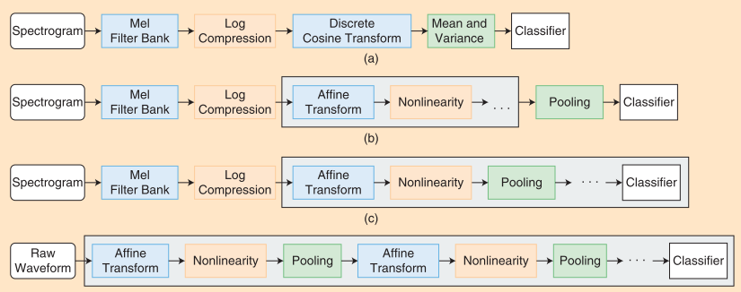
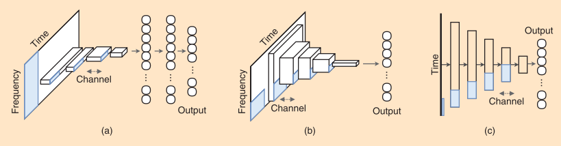
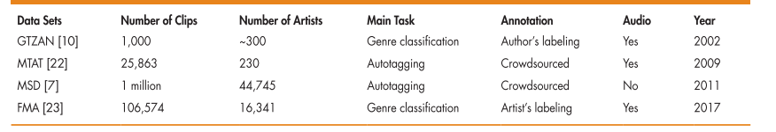
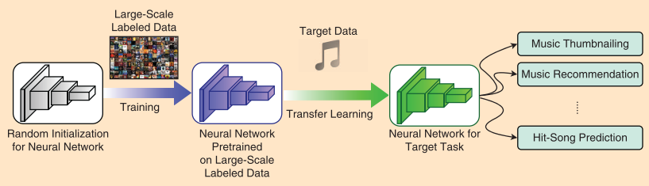
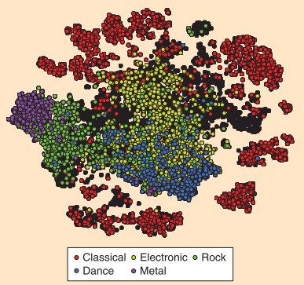

# 使用深度学习对音乐进行分类和标记

## 引言

在过去十年中，音乐流媒体服务已经大幅增长。 Pandora是该领域的一家公司，成功地实现了流媒体音乐的普及和推广。基于人工注释的内容分析部署音乐基因组计划。截至2018年中期，另一家公司Spotify拥有超过4000万首歌曲和超过1.8亿用户的目录，使其成为全球领先的音乐服务提供商。苹果，谷歌和亚马逊等大型科技公司也在加强其音乐服务平台。此外，人工智能扬声器，如亚马逊Echo，越来越受欢迎，为听众提供了一种新的，易于访问的方式来听音乐。

虽然音乐流媒体服务已经取得了巨大的成功。用户可以搜索各种音乐，服务目录的巨大规模创造了在众多选择中找到符合用户口味的歌曲的挑战。该问题的一般方法是协同过滤，其基于先前的使用数据(诸如游戏历史和歌曲评级)来预测可能感兴趣的歌曲。尽管协作过滤有效地检索歌曲并适应个性化推荐，但其性能受到普及偏差和冷启动问题等问题的阻碍，这是向用户推荐新音乐的主要挑战。基于内容的方法通常被视为对这些问题的补充解决方案。潘多拉电台是一个代表性的例子，因为它通过利用歌曲描述符的相似性来检索歌曲，例如流派，情绪，乐器和声乐质量。然而，高质量的手动注释成本高且不可扩展，这表明需要更好的方法来自动分类音乐内容。因此，在过去几年中，音乐信息检索(MIR)领域的许多关注集中在寻找自动化音乐流派和情绪分类以及标记音乐的过程的方法。本文介绍的方法是使用术语音乐分类和标记作为任务的一般表达式，涉及将音乐音频数据作为输入并自动使用某种特定的方式对其进行注释。

2011年关于音乐分类和标签的调查报告的重点揭示了该领域的先前趋势。其中调查的149篇论文中的大多数是基于“常规”机器学习框架，其涉及特征提取和分类器学习的流程。这些功能大多是手动设计的，以便在任务完成时简洁地表现出声学或音乐特征。然而，最近使用深度神经网络的突破已经将范式转变为以端到端方式学习表示，这开启了深度学习的时代。这种方法也适用于MIR中的各种任务。由于几个原因，研究人员特别积极地探索音乐分类和标记的问题。首先，这个任务可以理解为一个对音频片段的追踪问题，音频片段可以认为是一个二维图片类型的数据。其次是深度学习需要大规模数据集支持，百万级别歌曲数据集(Million Song Data Set, MSD)这个概念在2011年引入后基本解决了这个问题。虽然其他领域的最新发展激发了音乐的并行发展，但在开发用于音乐分类和标记的深度学习方法时，仍然需要考虑音乐信号的特定属性。

## 1. 从特征工程到端到端学习

人类根据从音频信号中提取的各种特征对音乐进行分类或注释。例如，伴随着咆哮声的严重扭曲的电吉他声音是金属音乐的明显特征。通过复调乐器(例如，钢琴或钢琴乐器)摆动节奏，切分音和彩色音乐
吉他为明显特征的音乐是爵士乐。将这些声学和音乐特征转换成计算机可以解释的数字表示是音乐分类和标记的本质。这通常涉及一系列计算步骤，将音频内容转换为时间频率表示，提取判别特征，随着时间推移对它们进行总结，并重复特征提取和摘要，直到获得音乐的正确类别为止。改进每个特征提取步骤以实现最佳性能的方法随着从基于主要知识的手工工程到端到端学习的学习算法的进步而发展。下图1说明了其框架中的四种不同的特征表示方法。

### 1.1 特征工程

根据乐器的选择，和弦进行，节奏，动态和其他音乐元素，可以以音乐的各种类型或情绪中的任何一种来排列和执行单行旋律。考虑到创建音乐的生成过程，音乐分类和标记的直观方法将需要对音乐元素的每个轴上的特征进行提炼并且对它们的分布进行建模。传统方法试图在此原则下制作各种音频特征。一个代表性的例子是Tzanetakis和Cook的开创性工作。他们通过使用三组音频功能来解决自动音乐类型分类问题：音色，音高和节奏。通过总结纹理窗口内的过零率，低水平光谱特征，低能量特征和MFCC来形成音色特征。通过将来自多路径估计器的音调内容封装成两种类型的直方图来提取音调特征，一种包含和声信息，一种包含音调范围信息。节奏特征由搏动直方图表示，该直方图通过子带分析计算周期性能量波动的间隔来解释时间规律性。最后，他们将所有特征组合在一起并将其应用于分类器，例如k-最近邻和高斯混合模型。由于这项研究为音乐分类和标记奠定了基础，许多研究研究开发了新的或更好的音频功能，并遵循两阶段框架，其中手工设计的功能被用作标准分类器的输入。

此特征工程方法基于领域知识手动设计每个计算步骤。例如，图1(a)显示了MFCC的计算流程。 Mel滤波器组和离散余弦变换分别基于心理声学和信号处理知识定制。这些手工设计的特征具有可解释性并且通常以紧凑的形式表达的优点。但是，大多数手工设计的音频功能都基于短时分析，可能无法捕获音乐中的高级信息。此外，工程过程与分类器中的数据驱动优化分开。目前，这种两阶段方法似乎导致了一个不完美的解决方案。

### 1.2 特征学习

深度学习的要点是输入数据的特征表示可以通过深度神经网络来学习算法。也就是说，学习是逐层实现的，在更深层次中学习更高级别的特征。这与特征工程方法相悖，因为领域知识在查找特征方面的参与度较低，输入数据在输入算法之前在最低级别处理。在深度学习的潮流中，已经引入了各种特征学习算法并将其应用于音乐分类和标记。我将它们分为以下三类：低级特征学习，卷积神经网络(CNN)和端到端学习模型。

- **低级特征学习**

早期的研究主要集中在学习低级音频功能以取代两阶段框架中的手工制作功能，如图1(b)所示。一种研究侧重于使用非监督学习算法学习有意义的频谱图字典，例如受限制的Boltzmann机器，K均值和稀疏编码。这些浅特征学习算法通常经过训练，可以将多个频谱图帧编码为高维稀疏特征向量。它们捕捉各种音乐可解释的时频模式。另一种研究侧重于有监督的特征学习，它利用预训练的多层感知器或深信念网络将短期频谱映射到类型或情绪标签。隐藏层激活用作学习功能。虽然在许多音乐分类和标记任务中，两个组都提供了比使用手工设计功能更好的性能，但它们仍然仅限于低级特征学习，并且采用的框架仍然有两个阶段。

- **卷积神经网络(CNN)**

最近，CNN一直是音乐分类和标记任务中使用最广泛的学习模型。 基于几秒钟的音频作为输入，可以以端到端的方式改进CNN以学习分层特征。 然而，如图1(c)所示，大多数成功的CNN模型使用频谱图(特别是mel谱图)作为输入表示，表明领域知识仍然有用。 在时频表示的局部性和平移不变性的不同假设下，已经提出了CNN模型的几种配置。 我将在下一节中介绍有关此类模型的更多详细信息。

- **端到端学习**

最近，已经进行了一些尝试来直接使用原始波形作为CNN的输入。 如图1(d)所示，没有一个步骤需要手工设计的表示，从而实现完整的端到端特征学习。 李等人。 提出了音乐分类和标记的成功模型。 他们发现，当底部卷积层采用小粒样本(例如，两个或三个样本)而不是典型的窗口大小(例如，256或512个样本)时，模型表现得更好。 然而，随着卷积层中的滤波器尺寸变小，模型逐渐变深，结果，训练需要更长的时间。

## 2. 深度学习模型

在本节中，我将回顾三种有代表性的CNN模型进行音乐分类，如图2所示。前两个模型是一维(1-D)和2-D CNN，每个模型都用于努力使网络更加灵活。这种趋向于更大灵活性的趋势继续采用最新且最成功的方法，即采样级别的CNN，其中时间序列音频信号用作输入。此外，我还将介绍一些可以提高性能的高级方法。虽然还有许多其他类型的体系结构，但我在本文中主要关注基于CNN的体系结构，因为它们被更广泛地使用。

为了清楚起见，在本节中，我使用Keras样式语法指定图层。 2-D内核由其在频率(f)和时间(t)轴上的长度指定，例如(f，t)。具有测量(f，t)，N个通道，(s1，s2)步幅和“有效”(或“相同”)填充的2-D核的卷积层被表示为Conv2D [filters = N，kernel_size =( f，t)，strides =(s1，s2)，padding =“valid”]如果它们遵循上述默认值，则省略一些参数。另外，可以在保持其顺序的同时省略参数名称(即，像Python语法一样)。 Conv1D的定义相似，但内核大小和步幅是1-D。最大池层定义为MP1D(pool_size)和MP2D(pool_size)。最后，我使用F，T，Nh指定特征图的大小，其中频率轴为F，时间轴为T，N个通道。

### 2.1 *1-D CNNs*

Dieleman等人启动了音乐分类和标签深度学习领域的一些最早进步。 Dieleman也在他的博客文章中做了一个重要的早期贡献，关于他在Spotify实习。网络结构如图2(a)所示，我在本文中将其称为1-D CNN。这里，“1-D”指的是第一个层的卷积运算的维数，不应该与内核的维度相混淆。

关于音乐信号输入的1-D CNN的假设行为是直截了当的。如前所述，1-D CNN采用时频表示，例如mel-频谱图，作为输入。在内核高度为F的情况下，第一个卷积层立即“看到”整个频率范围。也就是说，在训练期间，网络找到覆盖整个频率范围的一些模式。例如，中第一个卷积层内核的大小为(128,4)，输出通道数为256，即Conv2D [256，(128,4)，“valid”]，导致(1599,256)大小的特征映射。图2(a)中的Cas。从某种意义上说，这种结构在音乐上是合理的，因为它在网络设计之前同时具有强大的功能。详细说明，我知道在图像中，对象可以出现在任何位置，使得2-CN CNN成为流行的设计选择，如2-CN CNN可以处理这种空间变体。然而，音乐音频可能不是这种情况。在时频表示中，音乐对象或模式可以随时出现，但不能出现在任何频带中。这是因为不同的音频成分可以存在于不同的频率范围内并且具有微小的偏移。换句话说，我想要的不变性属性可能大部分沿着时间轴。这一特性使我能够看到和解释在第一个卷积层学到的东西。因为学习的内核直接在谱图输入上操作，所以我可以使用学习的权重来可视化内核，并查看哪些类型的歌曲最大程度地激活它们。例如，在图3中，我显示了几个选定内核的前四个相关标签。标签根据每个内核的标签激活分数进行排序(从上到下依次递减)。我可以看到相应的标签以某种方式解释了每个学到的内核。

一维CNN在计算上是有效的。其第一个卷积层占据整个频率范围，使后续层的特征图更小(频率轴的长度变为1)，因此，大大减少了网络参数的总数。然而，这实际上是1-D CNN的双刃化方面。少量参数意味着使用相对较小的数据集来训练网络更容易。同时，这意味着1-D CNN由于其有限的表示能力而无法充分受益于硬件资源和大规模数据集的开发。

上述1-D CNN的假设或强先验引入了一个明显的局限：完全缺乏频率轴移位不变性。在第一层中，假设128维频率分量具有其自身的含义;因此，沿频率轴的微小变化(即，音调变换)导致明显不同的激活。已经提出使用稍小的内核，例如用(126,4)作为替代(虽然在技术上使其成为2-D卷积)，但是它仅提供“全局”移位不变性。换句话说，假设接下来是(3，x)的最大合并，这种替代方法对于两个半音的全局转置是不变的。然而，它对于局部变化并不是不变的，例如，低音吉他组件中的e1频移，声乐组件中的e2偏移和钢琴组件中的e3偏移的组合，其中es是不同的(不同于在2-D CNN的情况下)。因此，1-D CNN在第一层中学习的表示仅限于整个频率范围的一些常见模式。

### 2.2 *2-D CNNs*

随着更大的数据集和更好的硬件资源变得可用，自然的一步是增加网络灵活性以改善表示学习。网络结构如图2(b)所示。我将其称为2-D CNN，因为它们专注于包括第一个的连续2-D卷积层。例如，[1]中的五层结构逐渐结合了较小的时频模式，以创建具有二维卷积层的较大层，例如，Conv2D [32,(3,3)]，这允许小通过以下最大池层移位，例如MP2D [(2,2)]。由于内核大小很小，填充策略(“有效”或“相同”)不是很有意义。

二维CNN假设更多的灵活性将有助于找到时频模式。灵活性可以有几个方面：沿两个轴的移位(或位置)不变性，模式的
大小以及模式内的小变形。它们通过具有小内核(通常为3×3)和2-D最大池层的2-D卷积层实现。虽然这可能与上一节中提到的时间轴和频率轴的不同含义相矛盾，但事实上，二维CNN的表现要好于1-D CNN。由于其简单的结构和良好的性能，2-CN CNN现在可能是最流行的音乐音频分类方法。出于两个原因，二维CNN通常需要比1-D CNN更好的硬件。首先，由于使用了连续的2-D内核，参数很容易超过1-D CNN的数量，因此需要更多的内存。其次，由于特征图的大尺寸，内核应该被卷积，因此2-D CNN的训练和使用增加了显着的计算负担。例如，对于1-D CNN，所有特征图的大小为(1，x，Nh)。频率轴始终为长度1，这使得特征映射1-D与通道。相反，对于2-D CNN，特征图的大小为(F，x，Nh)，即具有信道的2-D。这显着增加了模型训练过程的前向和后向过程中的计算。

到目前为止，我已经回顾了与1-D CNN相比2-D CNN的优缺点。在实践中，2-D CNN提供了一些实际优势。例如，硬件方面的改进使研究人员和从业人员在有足够数据时可以使用2-D CNN。一旦解决了数据大小和硬件资源的问题，2-D CNN的灵活性可以带来更好的性能。                       

### 2.3 *Sample-level CNNs*

如前一小节所述，2-D CNN可以在音乐分类和标记方面带来更好的结果，因为它们提供了更大的灵活性。通过丢弃2-D时频输入预处理阶段并以极其精细的方式直接从音频波形学习，样本级CNN向相同方向前进。虽然它不是直接从原始音频中学习表示的第一种方法，但它是第一种在短时间分析中实现最先进性能且内核大小明显短于常规窗口大小的架构。一个深刻的网络。

如图2(c)所示，该模型由一个[Conv1D(filters = 128，kernel_size = 3，strides = 3)]，9*[Conv1D(128,3,1)+ MP1D(pool_size = 3)]组成，和输出层。模型名称的基数(3)表示层的内核大小和跨度，而表达式(9)表示Conv1D + MP1D模块的数量。第一层学习128个1-D内核，该层可以在每个时间步骤提取某些1-D模式。第一卷积层的激活基于大小(时间步长，通道)，我可以将其理解为2-D时频表示，其中每个频率分量不一定是纯正弦曲线和频率轴没有排序。然后，将那些基本的非线性组件与卷积层组合。后续卷积层中的有效操作等同于1-D CNN。

样本级CNN的以下三个属性(均与模型的额外灵活性相关)可能有助于其强大的性能。首先，样本级CNN的动机之一是学习“相位不变”表示。时域内核涉及学习内核窗口内所有可能的时移。因此，大内核可能需要更多的过滤器来覆盖变化。样本级CNN中的短内核和最大池层的深堆栈有效地处理了相位变化。其次，通过学习直接应用于音频信号的内核，样本级CNN改善了为输入信号分析分配的频谱带宽。最后，如前所述，可以选择样本级CNN的第一卷积层中的内核来表示谐波分量而不是纯正弦波，其形成通常的2-D时频表示，例如频谱图。这种灵活性还可以提高学习功能的辨别力。
样本级CNN的缺点是它们的计算复杂性。 [2]的作者非正式地报告说，与1-D CNN模型相比，训练样本级CNN模型花了大约三到七倍。加速训练的一种方法是对波形输入进行下采样，但研究人员需要开发更有效的模型。

### 2.4 Advanced models

本节总结了几种解决基于深度学习的模型的各个方面的高级方法。 我注意到这些方法旨在实现不同的目标，并且它们不是相互排斥的，而是可以在模型中组合。

- **Convolutional recurrent neural networks(CRNN)**

卷积递归神经网络(CRNN)是CNN结构的一种变体，它使用复发层来代替最终的卷积层。 CRNN模型假设长期模式使用循环层比使用卷积层更好地编码。这可能是因为重要模式比输入持续时间短。因此，模式的时间动态是一系列短期模式而不是整个单一模式。

复现层的使用还使得模型在输入长度方面是灵活的，这对于音乐分类是有用的。[3]中的网络结构基于2-D CNN，但我注意到，复现层也可以添加到其他类型的CNN中。

- **Residual networks and squeeze-and-excitation networks** 

这些网络架构在2015年和2017年分别在ImageNet挑战中实现了最先进的性能[4]，[5]。 与通常的网络结构不同，剩余网络中的一些层共享跳过连接，其中层直接连接而无需任何操作。 研究人员热情地采用了这一想法，因为它可以训练非常深的网络(例如，超过100层)。 挤压和激励网络通过应用训练的通道加权，提供了另一种增强图层表示的方法。它已成功应用于[6]中的音乐自动标记。

- **Pairwise data**

最后，可以使用不同的监督学习方案对网络进行更宏观的修改。 当标签由成对相似性或排名组成时，可以通过使用三元组损失函数来实现度量学习。 使用此功能的网络需要三个数据样本：an-chor，positive项和negative项。 网络以锚和正项的嵌入彼此接近的方式学习各自的表示或嵌入，而锚和负项的嵌入则不是。 在MIR中，音乐内容嵌入用于预测音乐相似性。

## 3. 数据集和任务

在本节中，我描述了四种广泛用于音乐分类和标记的公共数据集。深度学习成功的关键因素之一是大规模公共数据集的可用性，这些数据集不仅用于深度学习模型的培训，还用于基准评估。 MIR社区组织了一个年度算法评估交换，称为音乐信息回归评估交换(MIREX)，其中包括几个音乐分类和标记任务。然而，深度学习的发展并没有从这次交流中获益，主要是因为MIREX数据集不向公众开放，培训和测试都由MIREX委员会进行。此外，隐藏数据集的体积不足以完全评估深度模型。据推测，这可能归因于与音乐内容相关的严重版权问题，因为商业音乐是通过专业声音制作者发布的，而且许可证受到更多限制。下面列出的四个公共数据集通过使用修剪或降级的音频剪辑(例如，具有16或22.05-kHz采样率的30秒)或无版权的音乐曲目来规避该问题。我注意到，这不是可用数据集的综合列表，而是一系列主要用于评估深度学习模型的数据集(表1)

### 3.1 GTZAN

尽管GTZAN的尺寸很小，但它的名字来源于George Tzanetakis的名字，他汇集了数据集，是音乐类型分类中使用最广泛的数据集之一。它包含1000个30秒的音频剪辑(每种类型有10种类型和100首歌曲)。最新版本使用艺术家分层的443,197和290音频剪辑分别进行训练，验证和测试，并且不会在这些组中重复使用。艺术家分层的分裂在音乐领域是独一无二的，因为艺术家可能在他们自己的歌曲中有类似的音乐风格。我注意到GTZAN也被用于在转移学习的背景下进行少量数据的目标任务。

### 3.2 MagnaTagATune

MagnaTagATune(MTAT)是用于音乐自动标记的最广泛使用的基准数据集之一。这是一个多标签音乐分类任务，不同寻常地注释流派，情绪，乐器和其他歌曲描述。数据集带有标签和相似性注释。使用不同数量的标签进行自动标记基准测试，包括188个标签(原始版本)，160个标签(MIREX 2009版)，以及最常用的50个标签。 50标签版本是目前最基准的版本。从数据集的16个预定义分区中，通常的做法是使用前12个用于训练，第13个用于验证，剩下的3个用于测试。该数据集包含25863个30s音频剪辑。其中等体积适用于训练深度神经网络。但是，数据集有缺点。例如，一些剪辑是从同一首歌剪辑的，并且音乐风格与流行的图表音乐略有不同，因为音乐曲目主要是从独立音乐家获得的。

### 3.3 MSD

MSD是由MIR社区的贡献创建的一组互补数据集。原始MSD包含艺术家级元数据以及Echo Nest(手工设计)音频功能，无需访问原始音频。然而，通过匹配标识数据(ID)，包括歌曲级标签，相似性，歌词，封面歌曲，用户收听历史和流派标签，MSD已经被其他元数据增强。为了训练采用光谱或波形的深度神经网络，研究人员使用了从7digital下载的30s预览音频片段。此外，Last.fm标记注释已广泛用于音乐自动标记的基准测试。

### 3.4 免费音乐档案

免费音乐档案(FMA)是Creative Commons许可下最新发布的大型数据集。该数据集提供丰富的曲目级别，专辑级别和艺术家级别的元数据，包括流派，听众数量和标签。它主要面向类型分类，并且有四个用于基准测试的子集：小，中，大和完整。小型和中型子集用于单标签类型分类，而大型和完整子集用于多标签类型分类。虽然主要任务是流派分类，但标签注释也包含在元数据中。

## 3.5 评估

如前所述，我将问题设置为多类(例如，流派或情绪分类)或多标签(例如，自动标记)任务。在多类任务中，主要使用准确度分数来评估模型。在多标签任务中，预测被视为独立的二进制输出。这些输出中的每一个都在注释和检索(或排名)上下文中进行评估。注释的主要指标是精确度，召回率和F值。它们是针对每个单词标签计算的并且是平均的。检索的度量包括接收者 - 操作者曲线下的面积(AUC)，平均平均精度以及等级K(P@K)的精度(或最高)。其中，AUC主要用于比较不同的深度学习模型。表2列出了迄今为止报告的性能比较，显示了由于MIR社区的累积努力，多年来MTAT和MSD获得的AUC如何得到改善。

我注意到每个指标的特征略有不同。例如，当我开发推荐服务时，P@K指标很重要，因为用户倾向于对排名靠前的K结果而不是所有结果感兴趣。因此，根据目标应用程序，可以在评估结果时选择不同的性能指标。

## 4. 实用指南

本节介绍了应用深度学习模型进行音乐分类和标记任务时的几个实际问题。

### 4.1 数据预处理

要检查的第一个参数是采样率。虽然44.1 kHz是商业音乐曲目的标准，但大多数数据集都被下采样到16或22.05 kHz。研究人员通常会进一步降低采样率(例如，8或1​​2 kHz)，因为他们观察到通过减少数据，训练更快而不会显着影响性能。 1-D和2-D CNN将频谱图作为音频输入。特别地，通常使用梅谱图或其他对数频谱图。这需要选择短期分析参数(例如，窗函数，跳大小)，梅尔波段大小和对数压缩强度。 Librosa是一个广泛使用的音频处理库。相比之下，样本级CNN除了采样率转换之外不需要任何预处理。波形输入已经以零为中心，并且通过后处理(例如，音频母版制作)很好地标准化商业音乐剪辑的幅度。

### 4.2 数据增强

数据增强是一种通过增加数据量来规范模型的技术。对于音频信号，数字音频效果，如音高变换或时间拉伸，是实现这一目的的有效手段。但是，这应该在音乐标签的性质不失真的范围内完成。在音乐分类文献中还没有找到数据增加，但是当目标任务的数据集很小时，它可能很有用。音乐数据增强是一个用于此目的的有用的音频处理库。

### 4.3 输入长度

语音标签通常在轨道级别为每首歌曲注释，音频长度通常为几分钟。因此，要使用音轨来训练模型，需要将它们切割成固定长度的段。这导致模型复杂性和标签噪声之间的折衷。如果缩短段，则可以使用更大的输入数据训练更紧凑的模型。然而，由于轨道内音乐的动态特性，从轨道级继承的标签往往更嘈杂，而紧凑的模型可能会错过学习高级音乐特征。另一方面，如果段延长，则可以减轻标签噪声，并且可以学习更长期的结构。但是，这需要更复杂的模型以及更多数据。通常的做法是使用3到6秒之间的段作为输入。一些复杂的模型需要30秒。轨道段与轨道共享相同标签的假设也被称为弱监督学习问题，就像段级监督是有噪声的那样。处理这种问题的一种先进方法可能是将所谓的注意模块添加到神经网络用于音乐情绪分类。

## 5. 应用

在本节中，我将解释如何将用于音乐分类和标记的大规模标记数据预先训练的神经网络模型应用于其他任务，例如跨数据集分类，提出建议，缩略音乐和预测热门歌曲， 如图4所示。

调查结果显示，使用大规模标记数据的预训练模型可以很好地估计音频内容之间的相似性(图5)。因此，通过所谓的转移学习技术，我可以在这些预训练模型之上构建具有稀疏标记数据的问题的分类器。例如，Choi等人[5]使用了大约250000MSD预览片段用于训练2-D CNN以对50个音乐标签进行分类。然后他们表明，使用CNN特征映射的激活的级联特征向量可以作为一个很好的通用音乐表示。这对于各种其他任务非常有用，例如分类交谊舞和其他子类，预测音乐可能刺激的情绪，区分声音和非声音，以及排序各种声音事件，如汽车喇叭和狗吠。

预训练模型还有助于解决制作基于内容的音乐推荐的挑战。例如，由音乐基因组计划提供支持的潘多拉可以通过将传统的协作过滤算法与音乐的分类属性相结合，为每个用户创建各种个性化播放列表。与纯协作过滤方法相比，通过预训练模型添加内容过滤以进行音乐分类和标记有助于确保在推荐的音乐列表中的声音一致性(例如，流派/风格，节奏模式，声音音色或表达情感的相似性)，这反过来改善了用户体验。通过内容过滤，还可以控制推荐音乐的(声学)多样性。

预训练模型的一个有趣的应用是音乐缩略图，即检测歌曲的尖锐度。[6]采用了一种用于音乐情绪分类的预训练模型和一种注意模块，以学习权衡歌曲不同片段在决定歌曲整体情绪方面的贡献。然后，假设高光通常是歌曲中最情绪化的部分，则使用移动窗口来聚合每段的注意力分数以选择歌曲的峰值。他们在高光检测方面取得了很好的成果，而没有使用任何与音乐亮点相关的标记数。

另一个有趣的应用是基于音频的热门歌曲预测。 使用预训练的1-D CNN模型进行音乐分类，作为预测歌曲流行度的更大CNN模型的一部分。实验表明，深度结构在预测歌曲流行度方面确实比浅层结构更准确，并且使用预训练的音乐分类模型进一步提高了准确度。我相信类似的预训练模型也可以应用于其他问题。

## 6. 局限和未来的挑战

在本节中，我们将讨论现有音乐分类和标记方法的一些主要局限性，并概述了未来研究的一些方向。

### 6.1 共享音频数据

版权侵权问题可能会限制对音乐分类和标记的广泛研究。人们无法从数据集中自由分发音频文件。解决此问题的常用方法包括共享预先计算的功能而不是音频文件，提供人们可以在网上找到音频预览的ID列表，或使用无版权的音乐。最后一种方法提供了更多选项，因为人们可以获得整首歌曲的音频文件。但是，要使用人们熟悉的流行音乐(通常受版权保护)，仍然需要一些其他解决方案。一种可能的方法是使用深度生成模型(如生成对抗网络)自动生成类似于流行音乐的音乐。

### 6.2 具有音乐意义的网络设计

我们还希望开发人员在深度神经网络的设计中更多地利用音乐的独特特征。在过去几年中，针对许多MIR问题的基于深度学习的方法已经建立了新的最先进的基准。然而，为了解释网络和更好的性能，需要未来的工作来将音乐领域的知识带回到网络设计的循环中。例如，不要期望网络可以自下而上地从不同的层次结构中学习音乐的抽象表示，而是通过网络(以自上而下的方式)通知中级特征，例如切分音的存在，减少和弦的广泛使用，以及合成器的使用。然后，可以在这些中级特征之上构建分类器。这需要研究团体共同努力，将资源和标签放在一起，找出在神经网络中使用它们的最佳方法，所有层都可能以端到端的方式进行培训。

结合音乐知识的另一种方式是不仅使用音频文件而且使用相应的乐谱(如果可用的话)。乐谱包含有关乐曲的丰富信息，例如旋律线和和弦序列。已经证明，通过分数的方法可以极大地改善源分离的性能。通过将乐谱与其实际演奏的录音进行对齐，我们还可以提取与演奏相关的特征(例如，速度的风格变化，音符持续时间以及不同演奏技巧的使用)，这些特征表征了人们如何解释这首曲子。然而，到目前为止，在神经网络中联合使用音频和乐谱的工作还很少。例如，未来的工作可以构建一个双流网络，它将音频文件及其分数或其他符号表示作为输入。

我们知道乐曲通常由几个元素组成，例如旋律，和弦，打击乐和基线，每个元素通常由不同的乐器演奏。然而，大多数用于音乐分类的神经网络作为一个整体处理音频输入而不区分声音的分量源。虽然深度学习方法在声源分离和音乐分类方面取得了最先进的成果，但在统一网络下联合解决这两个问题的工作却很少。因此，要求神经网络学习在执行特征学习时分离构成音频混合的音乐源可以是未来重要的方向。

### 6.3 词汇和个性化

在分类和标记模型中考虑的标签的多样性和覆盖范围也可以增加。理想情况下，最好有一个像潘多拉的音乐基因组计划那样精细的词汇量，它声称拥有大约450个音乐属性。一种可能的解决方案是利用社交平台上丰富的用户提供的标签，例如lastfm，Twitter或SoundCloud。然而，如何在学习有效的音乐分类器的同时摆脱社交标签的噪音和歧义仍然是一个悬而未决的问题。在想象极端可能性时，我们预见到能够使最终用户使用任意自然语言作为输入(例如，通过语音命令)来查询音乐的技术。例如，“嘿Google，我需要音乐让我感觉更好”和“Alexa，我无法入睡。也许是一些音乐？“鉴于人工智能扬声器的日益普及，这种情况可能很重要。为了支持这样的检索应用程序，我们需要与语音社区的研究人员合作，以更好地理解自然语言。我们的机器在描述音乐时考虑的词汇也必须进行扩展和调整，以应对丰富的自然语言。

此外，音乐和某些类型的标签之间的关联，例如情绪(例如，“快乐”，“悲伤”，“放松”)和用法(例如，“用于锻炼”，“用于阅读”)之间的关联是已知的是主观的。因此，对它们进行计算建模更加困难。但是，这些标签很重要，例如，如果我们想要自动创建符合用户心情或活动的播放列表。我们推测这些标签的分配必须是个性化的，考虑到听众的偏好以及这些标签对听众的“个人定义”。尽管对音乐情绪分类进行了大量研究，但迄今为止仍然存在一个有效个性化这类系统的挑战。

### 6.4 跨模态方法

我们在邻近的计算机视觉领域看到了许多跨模态研究，其目的是将视觉世界与文本世界相结合。值得注意的应用包括图像字幕，视觉属性的条件图像生成和跨模态检索。我们期望在MIR社区中也有类似的尝试，不仅用于分类和标记任务，还用于生成任务，例如标签条件音乐生成，旋律条件化歌词生成，专辑封面生成和音乐视频生成。为了促进对这些任务的研究，共享预先训练的模型或知识(例如，模型训练中的最佳实践)可以发挥重要作用。

音乐在我们的日常生活中很重要，机器学习有很多方法可以改善或改变我们体验和创作音乐的方式。通过总结迄今已知的内容，我们希望本文能够鼓励后续研究，以进一步加强我们对音乐的建模和理解。

## References

[1] M. Prockup, A. F. Ehmann, F. Gouyon, E. M. Schmidt, Ò. Celma, and Y. E. Kim, “Modeling genre with the Music Genome Project: Comparing human-labeled attributes and audio features,” in Proc. Int. Society for Music Information Retrieval Conf., Málaga, Spain, 2015, pp. 31–37. 

[2] S.-Y. Chou, L.-C. Yang, Y.-H. Yang, and J.-S. Jang, “Conditional preference nets for user and item cold start problems in music recommendation,” in Proc. IEEE Int. Conf. Multimedia and Expo, Hong Kong, 2017, pp. 1147–1152. 

[3] Z. Fu, G. Lu, K. M. Ting, and D. Zhang, “A survey of audio-based music classi- fication and annotation,” IEEE Trans. Multimedia, vol. 13, no. 2, pp. 303–319, Apr. 2011.

[4] G. Hinton, L. Deng, D. Yu, G. Dahl, A. Mohamed, N. Jaitly, A. Senior, V. Vanhoucke, P. Nguyen, T. Sainath, and B. Kingsbury, “Deep neural networks for acoustic modeling in speech recognition,” IEEE Signal Processing Mag., vol. 29, no. 6, pp. 82–97, 2012.

[5] A. Krizhevsky, I. Sutskever, and G. E. Hinton, “ImageNet classification with deep convolutional neural networks,” in Proc. Advances in Neural Information Processing Systems, Lake Tahoe, NV, 2012, pp. 1097–1105. 

[6] K. Choi, G. Fazekas, K. Cho, and M. Sandler. (2017). A tutorial on deep learn- ing for music information retrieval. arXiv. Available on https://arxiv.org/ abs/1709.04396
