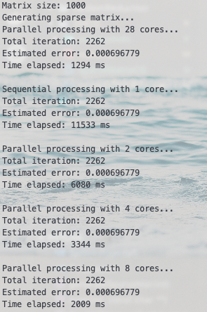
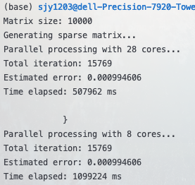
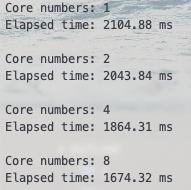
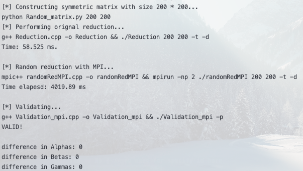
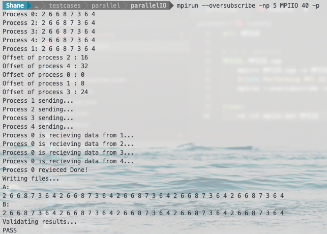
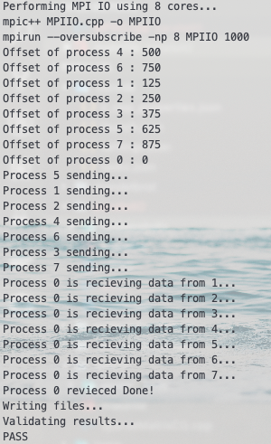

# Parallel Computing

## 环境

- **OS**: *Ubuntu 18.04.2 LTS (GNU/Linux 4.18.0-21-generic x86_64)*

- **physical processer**: 2

- **cores / processer**: 14

- **库**：`OpenMp`, `MPI`, `Eigen`,`OpenGL`

## 1. 稀疏矩阵求解

实现一个“大规模稀疏矩阵的Conjugate Gradient(共轭梯度)求解器”，即，求解$Ax=b$中的x，其中A为一个大型、稀疏矩阵。

### 1.1 代码设计及优化

使用高性能矩阵运算库Eigen实现对矩阵的运算加速。对A, x, b的初始化定义如下：

```c++
VectorXd x = VectorXd::Ones(MSIZE);
VectorXd b = VectorXd::Ones(MSIZE);
SpMat A = generateSparseMat(MSIZE);
```

共轭梯度求解器定义：

```c++
ConjugateGradient<SpMat, Lower|Upper> cg;
// total iterarions
cg.setMaxIterations(MSIZE*10);
// tolerance
cg.setTolerance(1e-3);
```

实现并行计算代码如下：

```c++
void ParallelProcess(SpMat A, VectorXd x, VectorXd b, int core_num) {
    initParallel();
    // core numbers
    setNbThreads(core_num);
    cout<<"Parallel processing with "<<nbThreads()<<" cores...\n";
    auto start = chrono::steady_clock::now();
    // solve
    cg.compute(A);
    x = cg.solve(b);
    auto end = chrono::steady_clock::now();
    cout<<"Total iteration: "<<cg.iterations()<<endl;
    cout<<"Estimated error: "<<cg.error()<<endl;
    cout<<"Time elapsed: "
        << chrono::duration_cast<chrono::milliseconds>(end-start).count()
        <<" ms"<<endl<<endl;
}
```

### 1.2 运行结果

运行：在终端该文件夹运行`make`。

- 1000维稀疏矩阵运行结果：



- 10000维稀疏矩阵运行结果：



### 1.3 分析

并行计算下多核的计算能力远远超过了串行计算的效率，28核计算1000维稀疏矩阵需要1秒而串行则需要12秒。当然计算耗时和核数并不是成线性的，这与核数增加之后进程通信开销增加等都有关系，结果符合预期。

## 2. Mandelbrot并行化

将分形算法用OpenMP并行化。

### 2.1 代码设计及优化

OpenMP实现并行化与算法的分离使得使用特别简易，可读性也很好。如下例子：

```c++
/* Define pseudocolor maps, ramps for red and blue,
   random for green */
    #pragma omp parallel for num_threads(num_trds)
    for(i=0;i<256;i++) 
    {
         redmap[i]=i/255.;
         greenmap[i]=drand48();
         bluemap[i]=1.0-i/255.;
    }
```

### 2.2 运行结果

运行：在终端该文件夹运行`make`。

- 运行时间对比：



- 单核：


- 双核加速：


- 4核加速：


- 8核加速：


### 2.3 分析

可见在不同核加速状态下展示的图片颜色有所不同，这是因为图片的色谱与迭代次数相关，在不同核数的加速下迭代次数不同，所以不难理解颜色的变化。

## 3. Random Reduction

- 读懂并将串行算法Reduction.cpp改成mpi并行。
- 用Random_matrix.py生成随机矩阵。
- 用Validationg_mpi.cpp验证结果。

### 3.1 代码设计及优化

主要思想是设置一个长度为3的数组存储三个矩阵的计算值，由主进程收集子进程的计算信息再进行迭代：

```c++
    /* Reductions with MPI */
    double values[3]; // for storing matrices mul temp results
    for (int i = 0; i < M; i++) {
        for (int j = 0; j < M; j++) {
            alpha =0.0;
            beta = 0.0;
            gamma = 0.0;
            for (int k = 0; k < N; k++) {
                values[0] = U_t[i][k] * U_t[i][k];
                values[1] = U_t[j][k] * U_t[j][k];
                values[2] = U_t[i][k] * U_t[j][k];
                if (id != 0) {
                    MPI_Send(values, 3, MPI_DOUBLE, 0, 1, MPI_COMM_WORLD);
                } else {
                    for (int id = 1; id < nproc; id++) {
                        MPI_Recv(values, 3, MPI_DOUBLE, id, 1, 
                        MPI_COMM_WORLD, &status);
                        alpha += values[0];
                        beta += values[1];
                        gamma += values[2];
                    }
                }
            }
            // Global variables
            Alphas[i][j] = alpha;
            Betas[i][j] = beta;
            Gammas[i][j] = gamma;
        }
    }
```

### 3.2 运行结果

运行：在终端该文件夹运行`make`。

- 对$200 * 200$的矩阵进行`Random Reduction`:



### 3.3 分析

通过使用MPI库，通过并行计算加速，同时保证的三个目标矩阵的`difference`都为0，充分说明了并行计算的可靠性。

## 4. MPI IO

用MPI编写一个并行I/O的例子。

### 4.1 代码设计及优化

- 创建一维数组并在n个进程均匀分布（无法整除部分分配给编号末尾的进程），数组内容初始化为随机整数

```c++
    /* Allocate buffer to procceses */
    if (id != nproc-1)
        blocksize = bufsize/nproc;
    else
        blocksize = bufsize-(nproc-1)*(bufsize/nproc);
    block = (char*)malloc((blocksize+1)*sizeof(char));

    /* Fill blocks with random integers */
    srand(time(NULL));
    for (int i = 0; i < blocksize; i++) {
        block[i] = (rand() % 10) + 1;
    }
    block[blocksize] = '\0';
```

- 利用并行I/O接口把数据写入文件中，输出每个进程写入的`offset`

```c++
    /* make sure all writes finish before we seek/read */
    MPI_Barrier(comm);
    MPI_File_open(comm, "mpiio.dat",
                  MPI_MODE_CREATE | MPI_MODE_WRONLY,
                  MPI_INFO_NULL, &fh);

    offset = id*(bufsize/nproc);
    cout<<"Offset of process "<<id<<" : "<<offset<<endl;

    /* write to file due to process's offset */
    MPI_File_write_at(fh, offset, block, blocksize, MPI_CHAR, &status);
```

- 执行一个集合操作，把所有进程的分块数据发送给0号进程，0号进程另外开一个1维数组空间a用户保存这些收取的数据

```c++
    /* 0 process store data sent from slave processes in array A */
    MPI_Barrier(comm);
    if (id == 0) {
        A = (char*)malloc((bufsize+1)*sizeof(char));
        B = (char*)malloc((bufsize+1)*sizeof(char));

        /* copy 0's data to A */
        memcpy(A, block, blocksize);

        /* Recieve data from slaves' process and store in A */
        for (int i = 1; i < nproc; i++)
            if (i != nproc-1) {
                // must specify offset in A to store different processes' data
                MPI_Recv(&A[i*(bufsize/nproc)], bufsize/nproc, 
                         MPI_CHAR, i, 0, comm, &status);
                cout<<"Process "<<id<<" is recieving data from "<<i<<"..."<<endl;
            } else {
                MPI_Recv(&A[(nproc-1)*(bufsize/nproc)], bufsize-(bufsize/nproc)*(nproc-1),
                         MPI_CHAR, i, 0, comm, &status);
                cout<<"Process "<<id<<" is recieving data from "<<i<<"..."<<endl;
            }

        cout<<"Process "<<id<<" revieced Done!"<<endl;
        free(block);
    } else {
        cout<<"Process "<<id<<" sending..."<<endl;
        MPI_Send(block, blocksize, MPI_CHAR, 0, 0, comm);
        free(block);
    }
```

- 0号进程另起一个串行I/O读入并行I/O操作写入文件的数据, 0号进程串行读入的输入放在1维数组空间b中，对比a和b验证I/O和通信是否正确

```c++
    if (id == 0) {
        /* 0 process sequential read slave processes' I/O data into array B */
        B = fileWrite("mpiio.dat", B, bufsize);

        if (P == "-p") {
            cout<<"A: "<<endl;
            for (int i = 0; i < bufsize; i++)
                cout<<int(A[i])<<' ';
            cout<<'\n';

            cout<<"B: "<<endl;
            for (int i = 0; i < bufsize; i++)
                cout<<int(B[i])<<' ';
            cout<<'\n';
        }

        /* Validation */
        if (resultValidate(A, B, bufsize))
            cout<<"PASS"<<endl;
        else cout<<"FAIL"<<endl;

        free(A);
        free(B);   
    }
```

### 4.2 运行结果

运行：在终端该文件夹运行`make`。

- 5核40个数据并行IO：



- 8核1000个数据并行IO:



### 4.3 分析

通过对A和B的对比可以知道I/O没有出错，可以使用`"-p"`来输出进程通讯的信息来debug，从两个例子中可以看出通讯过程没有出现错误，结果符合预期。

## 总结

通过这学期对并行计算课程的学习，我受益匪浅，收获颇丰。深度理解了并行计算的基本原理，并且通过去无锡的参观，了解到并行计算技术在工业界的应用进展。此次的四个任务也让我充分地了解了并行计算编程的细节，学习并使用了并行计算库MPI和OpenMP解决和优化算法。

在后深度学习时代，并行计算无疑是充分利用好计算力的一把利剑，在今后的学习和实践中，我也应当将并行计算的优势发挥到其中。

## References

[1] Introduction to MPI by examples. https://www.tankonyvtar.hu/en/tartalom/tamop412A/2011-0063_23_introduction_mpi/ar01s03.html

[2] Sparse matrix manipulations. https://eigen.tuxfamily.org/dox-devel/group__TutorialSparse.html#TutorialSparseFilling

[3] ConjugateGradient. https://eigen.tuxfamily.org/dox-devel/classEigen_1_1ConjugateGradient.html

[4] GLUT - The OpenGL Utility Toolkit. https://www.opengl.org/resources/libraries/glut/glut_downloads.php

[5] Introduction to MPI I/O. http://wgropp.cs.illinois.edu/courses/cs598-s16/lectures/lecture32.pdf

[6] DeinoMPI - The Great and Terrible implementation of MPI-2. https://mpi.deino.net/mpi_functions/MPI_File_read.html
